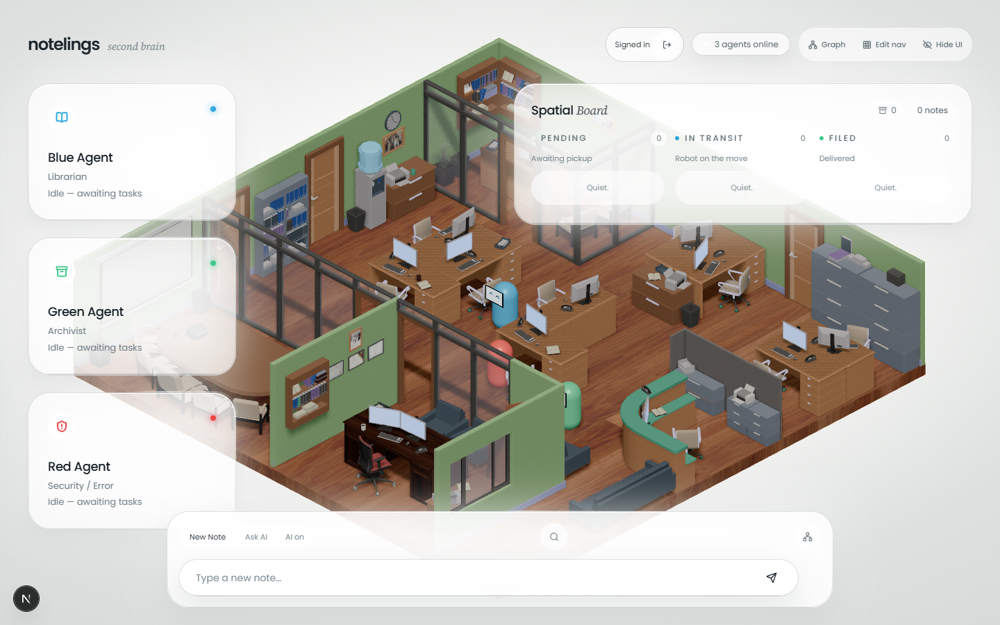
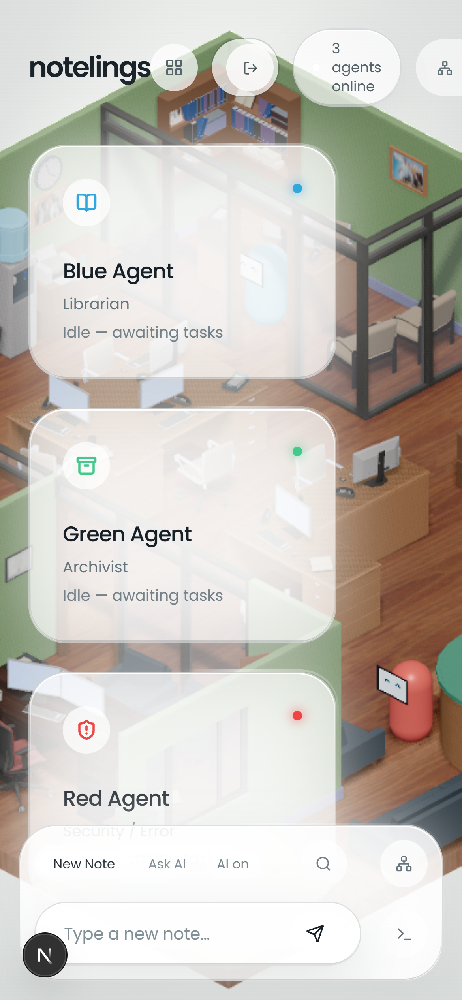
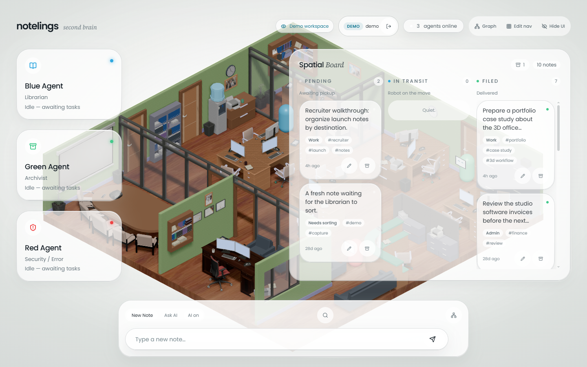
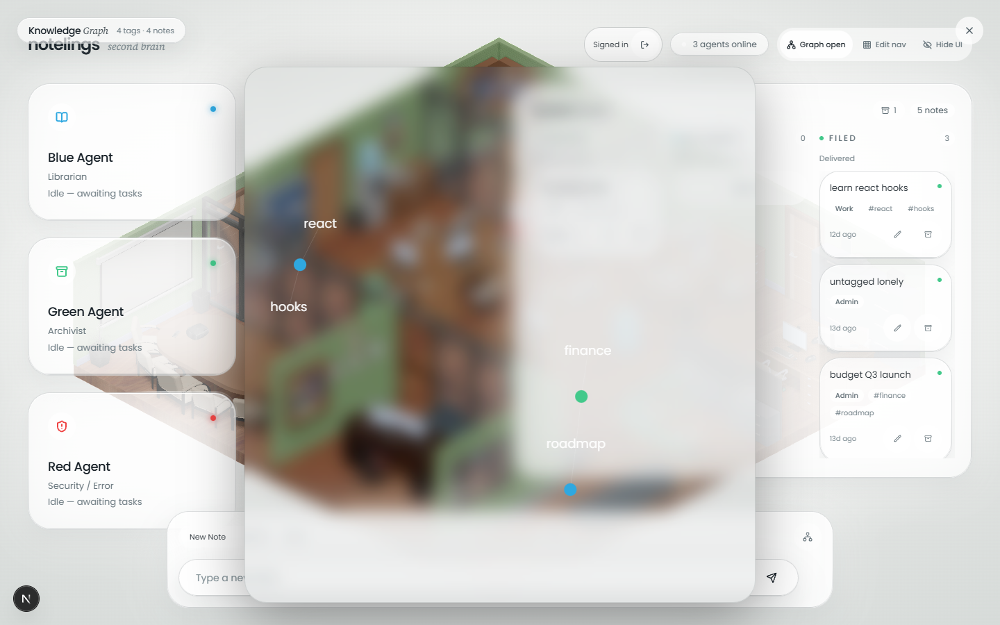
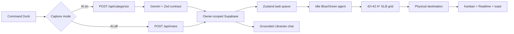

# Notelings

### A living 3D office for your second brain.

Notelings turns note capture into a calm, watchable workflow: type a thought, let Gemini classify it, and watch a capsule-shaped Librarian robot physically carry it across an isometric office to the right destination.

[](https://github.com/connorpaps/Notelings-App/actions/workflows/ci.yml)
[](https://nextjs.org/)
[](https://www.typescriptlang.org/)
[](https://r3f.docs.pmnd.rs/)
[](https://supabase.com/)

**[Open the live app](https://notelings-portfolio.vercel.app/)** · **[Explore the repository](https://github.com/connorpaps/Notelings-App)**

> Notelings is a portfolio project and private-workspace prototype. The public demo uses an isolated Supabase project, fictional seed data, resettable visitor writes, and a capped AI budget.

---

## The experience



Notelings makes the invisible parts of note organization visible:

1. **Capture** — type a thought in the Command Dock.
2. **Classify** — Gemini returns a strict `Work`, `Admin`, or `Uncategorized` result with tags.
3. **Persist** — the authenticated server route saves the note to owner-scoped Supabase Postgres.
4. **Enqueue** — a Zustand task dispatcher assigns work to the first idle Librarian.
5. **Navigate** — the robot follows a collision-safe A* route across the GLB office.
6. **File** — the note reaches a physical bookshelf, cabinet, or corkboard destination.
7. **Observe** — the Kanban board, terminal, Realtime updates, toast, and agent face all reflect the lifecycle.

AI is optional. AI-off capture saves a manually tagged note without calling Gemini and routes it to a visible **Needs sorting** destination.

---

## Product tour

### A responsive control center



The UI is designed as a control surface over the office rather than a dashboard that hides it. The light paper world keeps the colorful GLB readable, while frosted glass panels provide the operational layer:

- **Command Dock** for note capture, AI/manual mode, tags, and Ask the Librarian.
- **Spatial Board** with Pending, In Transit, and Filed columns.
- **Agent cards** for the Blue Librarian, Green Archivist, and Red Error Sentinel.
- **Terminal log** for lifecycle events and delivery feedback.
- **Responsive mobile surfaces** with safe-area padding, short-viewport bounds, and larger touch targets.

### Physical delivery



The office is not decorative background art. It is the product's stage and state visualization. Delivery tasks are represented by real agent movement, destination-specific routes, processing beats, completion toasts, and a carried note card.

### Knowledge Graph



The graph visualizes relationships without creating an unreadable note-to-note hairball:

- Tag hubs connect to note satellites.
- Archived notes are excluded.
- The force layout is warmed once and frozen to avoid a permanent physics loop beside WebGL.
- Selecting a note opens a side-peek editor without losing graph context.
- Editing tags recomputes the graph; archive remains an agentic office action.

---

## Highlights

### Visual systems

- A transparent, orthographic React Three Fiber canvas with a detailed GLB office.
- Code-generated capsule robots with LCD-style faces: `^ ^`, `- -`, `O O`, and `X X`.
- Light paper-and-glass visual language documented in [`DESIGN.md`](DESIGN.md).
- Reduced-motion handling across UI transitions, panels, cards, graph, and modal surfaces.
- High/balanced renderer profiles with DPR capped at 1 and measured shadow/SSAO trade-offs.

### Intelligent note operations

- Gemini categorization with strict Zod output contracts and a 10-second failure boundary.
- Deterministic degraded behavior when the provider is unavailable.
- AI-off manual capture that never calls the categorizer.
- Grounded “Ask the Librarian” chat with clickable citations, deterministic count answers, and embedding retrieval for larger vaults.
- Tag Explorer, edit modal, soft archive/restore, hard delete, and agentic trash delivery.

### Engineering boundaries

- Next.js App Router route handlers with origin checks, authenticated session verification, bounded input, rate limits, and redacted observability.
- Supabase owner-scoped RLS and Realtime note synchronization.
- Mode-aware private root and isolated `/demo` routing on one Vercel project.
- A* navigation over a baked 42×42 GLB grid with runtime path-safety checks.
- Playwright contracts for scene composition, renderer profiles, physical delivery, degraded capture, graph behavior, mobile layout, and private/demo API namespaces.

---

## How it works



### Active scene architecture

```text
app/page.tsx
├── PaperWorldBackground
├── OfficeCanvas
│   └── NewOfficeScene
│       ├── NewOfficeModel (3d_note_office.glb)
│       └── AgentLayer
├── NotelingsUI
└── GridEditorPanel (hidden by default)
```

The active runtime no longer imports the original OBJ office. That historical implementation and its assets are retained under [`archive/legacy-office/`](archive/legacy-office/README.md) for reference, outside the shipped application path.

---

## Technology stack

| Area | Technology | Why it is used |
| --- | --- | --- |
| Application | Next.js 16.3 App Router | Server/client composition, route handlers, deployment on Vercel |
| UI | React 19 + TypeScript 5 | Typed component architecture and browser interaction |
| Styling | Tailwind CSS v4 + shadcn/base-nova + `class-variance-authority` | Consistent, composable light paper-and-glass surfaces |
| 3D | React Three Fiber 9.7 + Three.js 0.185 + Drei 10.7 | Declarative scene graph, GLB loading, animation, and scene utilities |
| Effects | `@react-three/postprocessing` | SSAO, Bloom, and tone mapping for diorama depth |
| State | Zustand 5 | Agent state, task queue, note mirror, terminal events, UI view state |
| Data | Supabase Postgres + Auth + Realtime | Owner-scoped persistence, sessions, and live note status updates |
| AI | Vercel AI SDK 7 + Google Gemini | Categorization, grounded chat, embeddings, and UI-message streaming |
| Validation | Zod 4 + React Hook Form | Input limits, route contracts, and form validation |
| Motion | Framer Motion 13 | Accessible UI transitions and state feedback |
| Testing | Vitest 4 + Playwright 1.62 | Pure domain tests, route boundaries, scene contracts, and browser flows |
| Delivery | GitHub Actions + Vercel | CI validation and unified private/demo deployment |

---

## Local setup

### Prerequisites

- Node.js 22.x
- npm
- Git
- Git Bash on Windows for the committed POSIX helper scripts
- A Supabase project and Gemini API key for real authenticated note submission and chat

### Install and configure

```bash
npm ci
npx playwright install chromium
cp .env.example .env.local
```

Fill `.env.local` from `.env.example`. Never commit `.env.local` or any provider/database credentials.

The office and UI render without credentials. Real capture, Auth, Realtime, and provider-backed AI require the appropriate local environment. AI-off capture remains available without a Gemini call once a session is configured.

### Run the app

```bash
npm run dev
```

Open <http://localhost:3000>.

On Windows Git Bash, the detached helper is useful when you want the app to survive the terminal session:

```bash
bash scripts/dev-server.sh start
bash scripts/dev-server.sh status
bash scripts/dev-server.sh logs
bash scripts/dev-server.sh stop
```

The current deployment uses `/` for the private workspace and `/demo` for the isolated portfolio workspace. See [`docs/DEPLOYMENT.md`](docs/DEPLOYMENT.md) for the environment matrix and release runbook.

---

## Validation

Run the fast gates locally:

```bash
npx tsc --noEmit
npm test
npm run lint
npm run build
npm audit --omit=dev --audit-level=high
```

Run browser coverage against a fresh test server:

```bash
CI=1 npm run test:e2e -- --workers=1
```

The GLB/WebGL suite is intentionally serial on SwiftShader-heavy machines. `CI=1` ensures Playwright starts a fresh server with test-only auth, renderer, and screenshot settings; do not interpret a reused signed-out server as a product failure.

---

## Privacy and security notes

- Private notes are owner-scoped through Supabase Auth/RLS.
- Service-role Supabase keys stay on the server and are never imported by browser code.
- Gemini processing is disclosed and can be bypassed with manual capture.
- The demo uses a separate Supabase project, fictional seed data, resettable writes, and daily AI ceilings.
- Request observability redacts note content, prompts, provider responses, tokens, cookies, and embeddings.
- This repository intentionally contains no license. **All rights reserved.** It is public for portfolio and reference purposes; reuse, redistribution, or commercialization requires written permission.

More detail: [`docs/architecture/data-and-security.md`](docs/architecture/data-and-security.md).

---

## Repository map

```text
app/                    Next.js pages, layout, API routes, auth callbacks
components/notelings/   Paper/glass UI, board, dock, graph, chat, note controls
components/office/      Active GLB scene, agents, A*, grid editor, render profiles
lib/                    Pure note/domain logic, AI helpers, auth, Supabase clients
supabase/               Fresh schema and reviewed migrations
e2e/                    Playwright scene, delivery, graph, mobile, and deployment tests
docs/architecture/      Current runtime and data/security documentation
docs/images/            Sanitized README screenshots
docs/archive/           Historical specs, audits, plans, and references
archive/legacy-office/  Retained inactive OBJ office implementation and assets
scripts/                Development, demo, grid, performance, and smoke tooling
```

Internal AI memory, hooks, editor metadata, and vendored skills remain local-only and are intentionally excluded from the portfolio repository. The public project surface is documented by this README, [`PRODUCT.md`](PRODUCT.md), [`DESIGN.md`](DESIGN.md), and [`docs/architecture/`](docs/architecture/). [`skills-lock.json`](skills-lock.json) records development-skill provenance without shipping the vendored implementations.

---

## Roadmap and boundaries

Already shipped:

- 3D office, capsule agents, A* delivery, task queue, Gemini categorization, and degraded capture.
- Kanban control center, terminal lifecycle log, Realtime sync, edit/archive flows, Tag Explorer, grounded RAG chat, citations, embeddings, and Knowledge Graph.
- Authenticated private/demo routing, owner-scoped RLS, AI budgets, loading/degraded states, renderer profiles, responsive/safe-area hardening, and browser validation.

Intentionally out of scope:

- Physics/colliders, rigged/skeletal robot animation, multi-user sync, and automatic Obsidian vault sync.
- Treating the portfolio demo as an unrestricted public SaaS boundary.

---

## Contributing

See [`CONTRIBUTING.md`](CONTRIBUTING.md) for focused change guidance and the supported validation commands.

---

## License

**All rights reserved.** No license is granted to copy, modify, distribute, sublicense, or commercialize this code without written permission from the author.
